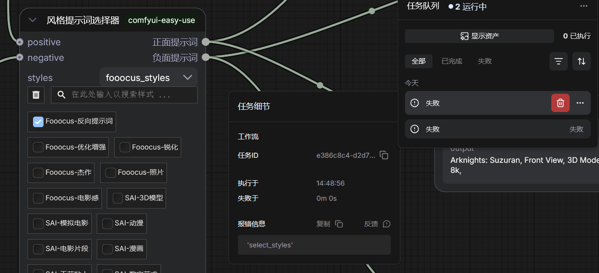
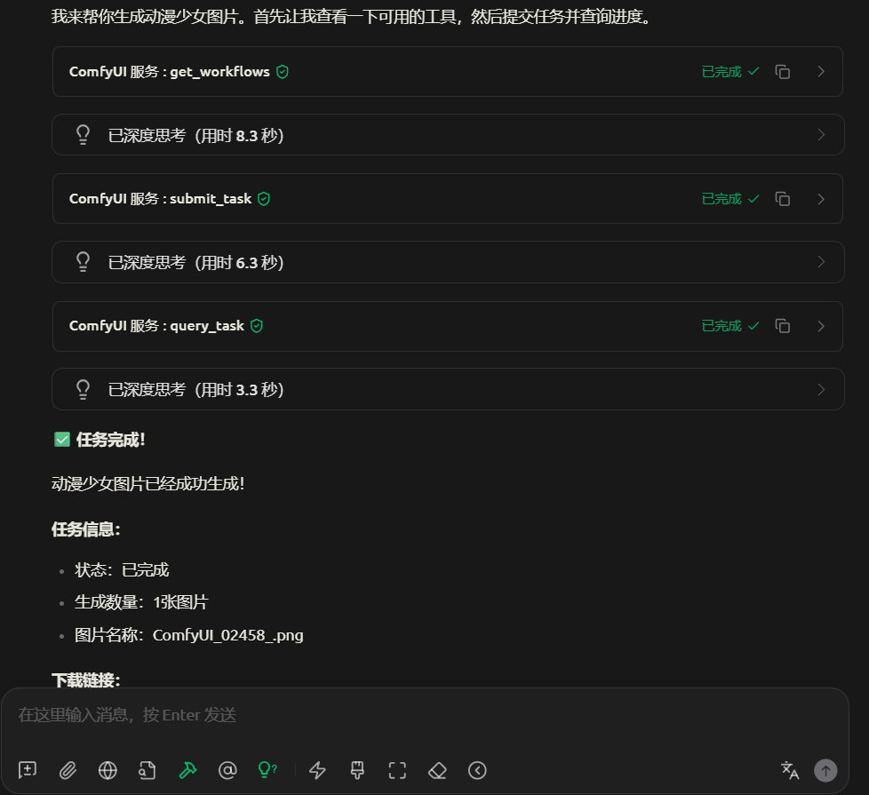
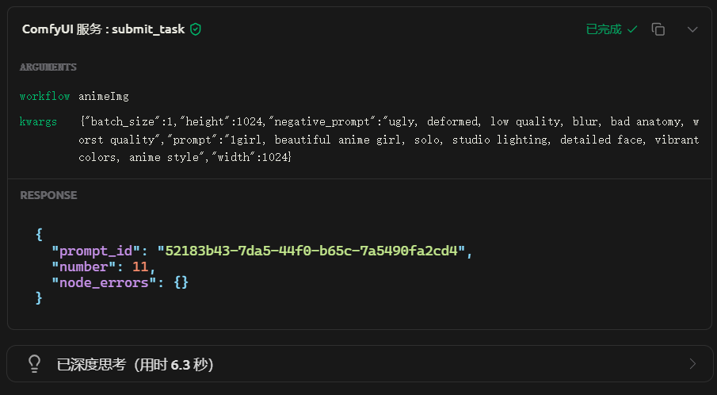
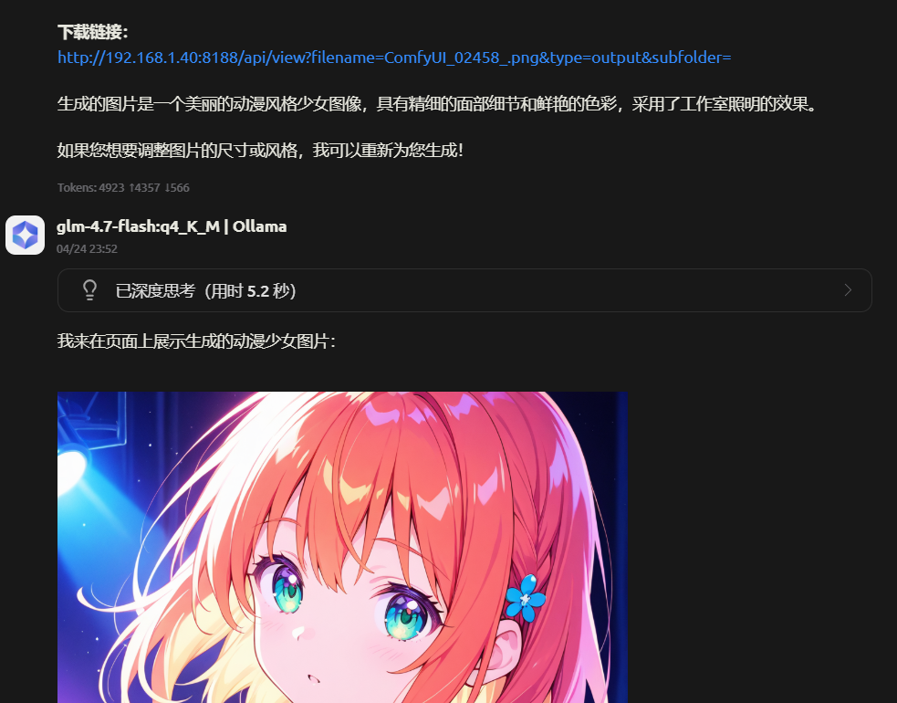
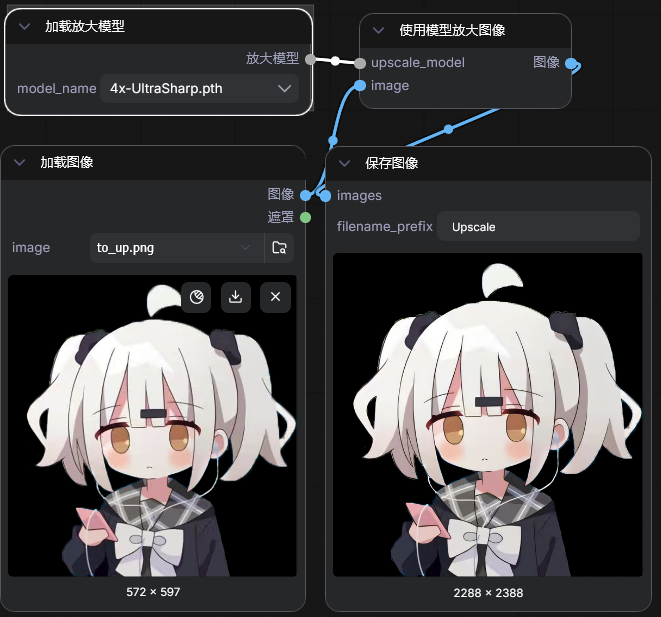
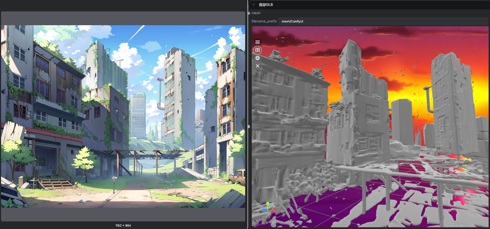
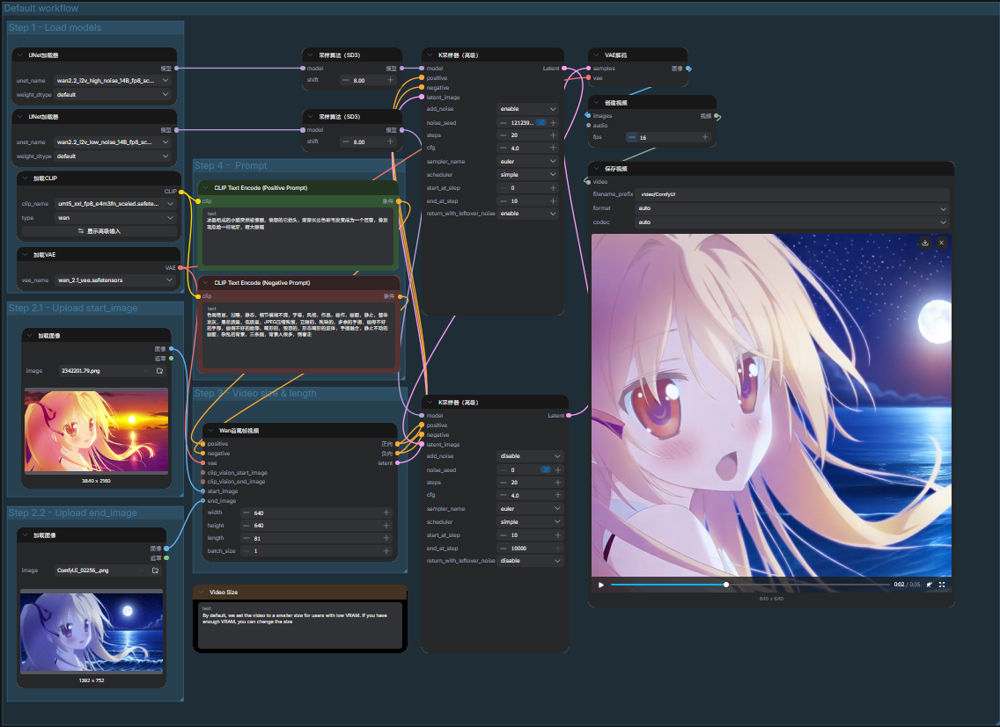
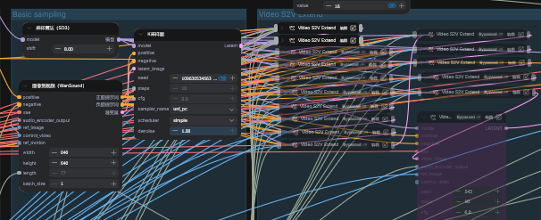

# ComfyUI 工作流工具

## 此项目是做什么的

- 提供导入导出工具，方便在 ComfyUI 中导入导出工作流。并提供扫描工具，以删除不被所有工作流使用的模型
- 基于导出的工作流，提供在 ComfyUI 上通过 API 调用工作流的能力，方便其他应用使用
- 基于导出的工作流、编写的工作流描述文件，通过 MCP 协议为 LLM/Agent 提供 ComfyUI 的调用能力，实现通过对话完成图片生成
- 分享、备份一些实用的工作流，见[分享](#工作流分享)

## 使用本项目

- 克隆项目到本地
- 安装依赖（使用 `uv sync` 安装）
- 修改配置（将 `.env.example` 复制为 `.env`，并修改其中的配置）
- 运行项目（使用 `uv run src.main 参数` 运行项目）

### 工作流管理

- `python -m src.main workflow list`: 列出所有工作流
- `python -m src.main workflow export`: 导出工作流到备份目录
- `python -m src.main workflow import`: 导入备份目录的工作流
- `python -m src.main workflow info XXX`: 查看工作流 XXX 引用的模型，含 VAE、LoRA（可能包含干扰项）

### 模型管理

- `python -m src.main model scan`: 扫描模型目录，列出所有模型文件，并在通过控制台确认后删除未引用的模型文件，你有机会多次确认

### API 适配器

ComfyUI 的 API 调用需要提供工作流 json，本项目提供了一个 API 服务器，用于接收外部请求。

程序会将其转发给 ComfyUI 服务实现 ComfyUI 工作流的接口调用。

注意，ComfyUI 并未提供 API 文档，本项目的实现均基于网页端的调用，以及 ComfyUI 代码分析，比如 [server.py](https://github.com/Comfy-Org/ComfyUI/blob/master/server.py)

设计上仅适合调用一些简单的工作流，入参较少的情况，方便集成在 Agent 等场景中使用；

对于复杂工作流、传参的情况支持有限，如需使用，建议查看[已知问题](#已知问题)，确保你的场景可以接受这些问题。

#### 使用此功能的步骤

- 已确认 *[已知问题](#已知问题)* 可被接受或解决
- 确保 ComfyUI 服务已启动
- 要使用的工作流已在 ComfyUI 中测试通过，且通过本程序导出到备份目录（孤节点不需要删除，程序会默认忽略，比如 markdown 备注节点）
- 打开API目录下的工作流 `.json` 文件（`PARSED_API_DIR` 目录，不是备份的文件），替换其中的关键字，详情参考下文接口部分
- `python -m src.main server`: 启动 API 转发服务器

#### 支持的接口

- `POST /submit`: 提交任务请求
  - 请求体：`requestBody`
    - `workflow`：要使用的工作流名称，即备份目录中的文件名（不含 `.json` 后缀）
    - `kwargs`：工作流参数，键值对格式，工作流 json 文件中的 `{{param_name}}` 会被替换为请求参数 `.kwargs` 对象中对应字段的值，无论它处于什么层级（直接字符串替换）
  - 响应体：`responseBody`，提交成功后立即返回，不等待任务完成
    - `prompt_id`：ComfyUI 任务 ID，用于查询任务进度和下载输出
    - `number`：ComfyUI 返回的序列号
    - `node_errors`：出现错误时，ComfyUI 返回的错误信息
- `GET /progress/{prompt_id}`: 查询任务详情
  - 请求参数（url）：
    - `prompt_id`，ComfyUI 任务 ID，来自 `/submit` 接口的响应体中的 `prompt_id` 字段
  - 响应体：`responseBody`，立即返回，无论任务是否完成
    - `status`：任务状态，`completed` 表示任务完成，`in_progress` 表示任务进行中，`failed` 表示任务失败
    - `output`：一个列表，包含工作流的全部输出，透传 ComfyUI 返回，可能包含图像、文字等类型。你可以去掉多余的预览节点以获取更简洁的输出。每个元素包含如下字段：
      - `type`：输出类型，如 `images`、`text` 等
      - `res`：输出结果，如果为 `text` 则返回一个字符串，`images` 则返回一个包含 `download` 接口所需字段的对象
    - `outputs_count`：任务输出的物料数量
- `GET /download`: 下载任务输出
  - 请求参数（query）：均来自 `/progress` 接口的响应体
    - `filename`，要下载的文件名
    - `subfolder`，要下载的文件所在子目录
    - `type`，要下载的文件类型

#### 已知问题

1. 缺少参数

    

  - 问题现象：成功提交后，查询任务进度为 failed，在 ComfyUI 中查看报错信息为一个字段名，比如上图显示 `select_style`，没有任何其他信息
  - 问题原因：使用的节点中包含无法通过连线控制的参数，比如图中的风格选择器中，因这种参数的特性，参数在保存工作流时丢失（参数名也丢失，无法兜底写默认值），转为 API 时也无法传递，进而报错
  - 问题解法：
    - 方案一（推荐）：修改工作流，去掉无法通过连线控制的参数，或者替换为其他可控的节点（如果有的话）
    - 方案二：手动在 ComfyUI 中导出 API 格式的工作流，替换程序生成的 json 文件中的参数值，并替换 seed 参数值为 `{_SEED_}` 后方可调用（SEED 相同 ComfyUI 会跳过执行），但每次导出都需要重新操作一遍

### MCP 支持

本项目提供了 MCP 服务实现（HTTP 方式），使 LLM/Agent 能够调用 ComfyUI 工作流。

#### 使用方式

1. 完成 API 方式的所有步骤，因为 MCP 方式下，仍然需要使用 API 来调用 ComfyUI，所以所有的前置工作均需要。
2. 为你要通过 MCP 使用的工作流创建 Schema 文件
    1. Schema 文件必须与 `api` 目录中对应的文件同名，但使用 `yml` 格式
    2. 在 yml 文件中，必须配置 `name`(工作流名称), `description`(工作流描述), `arg_schema`(参数 schema) 字段，`arg_schema` 是一个 JSON schema 对象，直接透传给 LLM/Agent，没有明确格式要求，描述清楚需要的参数要求即可。需要注意，参数名称必须与 `api` 中使用的参数名匹配，可以参考 `workflow/mcp/Nahida(NSFW).yml` 文件。

    

3. 使用 `python -m src.main mcp-server` 启动 MCP 服务，监听端口为 `8181`（允许配置），目前不允许 MCP 服务与 API 服务同时启动，如有需要需自行修改。
4. 在 LLM/Agent 中配置 MCP 服务，以 `HTTP` 方式连接，地址为 `http://localhost:8181`。
5. 连接成功后即可使用。

#### 提供的工具

1. 查询可用的工作流：扫描 `mcp` 目录，并读取每个 `yml` 文件，返回所有工作流的名称和描述，直接给到 LLM/Agent。
2. 提交生成任务：与 API 方式相同，响应直接返回给 LLM/Agent。
3. 查询任务进度：与 API 方式有少许不同，在 MCP 方式下，会直接返回 ComfyUI 的下载链接，不再经过服务器转发。LLM/Agent 只得到下载链接，如果网络环境可以访问 ComfyUI 服务，即可直接下载，否则需对外暴露 ComfyUI 服务端口或启用转发服务。

## 工作流分享

### 图像生成

#### realistic

> 注意，该模型已更新，建议使用新模型

使用 [RealVisXL](https://civitai.com/models/139562/realvisxl-v50?modelVersionId=789646) 的工作流

现实主义风格，适合风景

有手部问题，略严重

#### SD1.5(NSFW)

使用 [cuteyukimixadorable](https://civitai.com/models/28169/cuteyukimixadorable-style) 的工作流

独特的画风，适合生成可爱卡通风格人物图片，可以访问模型页面查看更多实例

有手部问题但可控

不认识大部分 ACG 角色

BaseModel: SD 1.5

#### Nahida(NSFW)

使用 [zukiCuteILL_v60](https://huggingface.co/John6666/zuki-cute-ill-v60-sdxl) 的工作流

不太“安全”的模型，也可用于普通的图片生成场景。该模型在C站的页面已挂，[作者的C站链接](https://civitai.com/user/ZU_KI)

画风比较可爱，适合生成可爱、卡通风格人物图片，擅长 NSFW 内容

认识大部分 ACG 角色

BaseModel: SDXL

### 图像编辑

#### 区域重绘 Inpaint

使用遮罩对图像特定区域进行重绘

适合对画面少部分内容进行修复、修改、替换

不适合在重绘部分完成过于复杂的绘制任务

下图为通过遮罩引导，替换地面为落满繁花的水面的效果

#### 图像编辑 Qwen2509

通过纯提示词引导进行图像编辑，效果非常好

最多能参考三张图片，但会有混淆问题

能够进行稍复杂的编辑操作

下图为通过提示词移除图中拉门的效果

#### 图像去水印

通过模型自动识别水印并进行遮罩重绘以去除水印

水印识别效果尚可

重绘效果一般，可以试试其他模型来重绘

#### 图像放大

放大4倍，简单有效，放大效果不错

### 3D

> 3D 玩得比较少，并未发现什么好用的工作流

#### 图像转3D模型

模板工作流，效果如图

### 音频处理

#### 音乐生成（ACE1.5）

目前 ACE1.5 的效果听上去不如 Suno 的 V3.5（更早的版本没试过），仅可用于玩一玩，并不推荐使用

开源方案中，HeartMula 3B效果更好一些（主观感受上大致相当于 Suno V3.5，7B尚未开放），但是 ComfyUI 集成不好

#### 语音克隆

在一个工作流里面完成音色克隆、语音生成的全过程

克隆效果很好，比如 [**这个音频**](doc/civilization.mp3) 是使用铃兰（来自明日方舟）的音色，念文明6的开场词

### 视频处理

#### Wan2.2 图生视频

模板工作流，图片+提示词生成视频

视频可能出现静止问题、诡异画面等情况（相对 Wan2.1 好多了）

生成速度较慢，不建议一次生成太长的视频

视频效果可参考：[0经费出道？给二阶堂姐妹拍了一支绝美但生草的MV](https://www.bilibili.com/video/BV18GQQBoEGx/?share_source=copy_web)（该视频为本工作流的输出，经剪辑后得到）

#### Wan2.2 首尾帧视频

模板工作流，首尾帧图片+提示词生成视频

视频容易出现静止、奇怪的过渡等问题，相对 Wan2.1 有提升

16G显存设备上，`640*640` 5s 视频需要 733s，还提供了更快速的版本（质量有所下降）

以下是使用效果，中间过渡时怪怪的：

Wan2.1 首尾帧视频效果可参考：[音乐都能当编程语言了？来听听代码是什么旋律](https://www.bilibili.com/video/BV12xKWz5EnJ/?share_source=copy_web)（该视频右下角的视频为 Wan2.1 的首尾帧视频一路拼接到尾）

#### hunyuan 提示词直接出视频

模板工作流，仅用提示词出视频

视频效果一般，未深入使用

#### 音频+图片+提示词生成视频

比较实用的一个工作流，可以让图片中的人按照配音开口说话，也是基于 Wan2.2 的工作流

真人图片的情况也可以对上口型

可以按照提示词做动作

按照 chunk 来扩展，每加一个节点拓展一个 chunk，以实现长视频生成。

但测试发现，如果生成太长的视频有可能会出现一些奇怪的情况，建议不要生成一分钟以上的视频。

[**效果视频**](doc/civilization.mp4)（使用上面的音频，加上一个绿幕铃兰图像生成）
